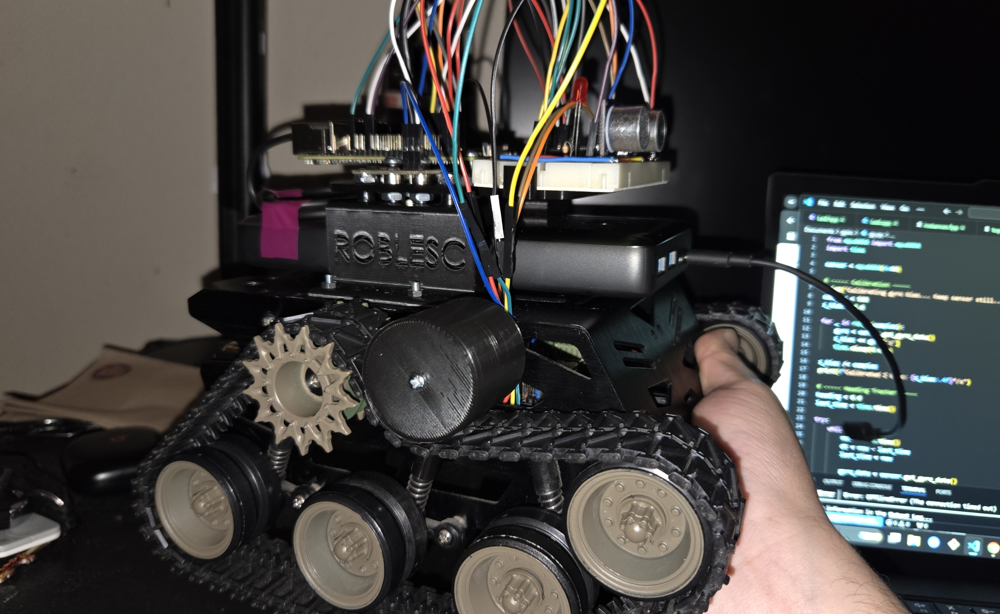

# 🤖 Tank – F´-Based Differential Drive Platform

  

📺 <strong>Demo Playlist:</strong>  
<a href="https://youtube.com/playlist?list=PLc2_zoZcQme6YFMZ-624sp3PF5laEbIG0&si=dT59qtRuxb4fQL4O" target="_blank">Watch on YouTube</a>

---

**Tank** is a modular robotics project powered by <a href="https://github.com/nasa/fprime" target="_blank">NASA’s F´ (F Prime)</a> flight software framework. Designed for reliable motion control, obstacle sensing, and autonomous decision-making, the robot uses a differential drive system with real-time feedback via gyro, encoder, and ultrasonic sensors.

---

## 🧠 System Overview

The robot’s software is architected using the <a href="https://fprime.jpl.nasa.gov/latest/docs/user-manual/design-patterns/app-man-drv/" target="_blank"><strong>Application-Manager-Driver</strong></a> pattern, with custom F´ components for motion control, high-level logic, and environment sensing.

### Components

| Component     | Role                                                                                     |
|---------------|------------------------------------------------------------------------------------------|
| `ACE`*        | Central mission controller that coordinates movement modes *(in progress)*               |
| `motion`      | Motion controller: reads sensors, runs PID, and sends motor commands                     |
| `proximityGuard`* | Obstacle detection using an ultrasonic sensor *(in progress)*                            |
| `motCmnd`     | Low-level component that sends `U16`-encoded I²C commands to Romeo                       |

\* Components marked with an asterisk are currently in progress.

## 📦 Hardware Integration

- **Romeo board**: Drives motors based on I²C commands from Raspberry Pi  
- **MPU-6050**: Provides gyro data for heading PID  
- **Rotational Encoder**: Tracks distance for straight-line motion  
- **Ultrasonic Sensor**: Measures proximity for obstacle avoidance  
- **Raspberry Pi 4**: Runs the F´ flight software stack  
- **🔧 Zybo Z7-10 FPGA (Temporary)**:  
  Replaces the Romeo motor controller with a fully hardware-based I²C slave. Receives commands from the Raspberry Pi and generates PWM output in Verilog.  
  -> [View the custom FPGA I2C project here](https://github.com/Robles-C/FPrime-Robot/tree/main/verilog)

---

## 🔁 Key Features

- Modular F´ component architecture
- I²C command packing: 1 byte direction control + 1 byte speed control
- PID-controlled turning using gyro
- PID-controlled movements using encoder
- Obstacle detection and LED response
- Rate-group-based scheduling for precise timing
