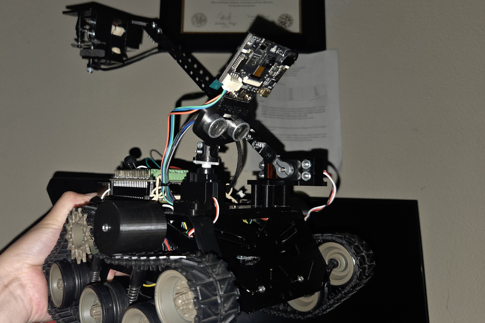
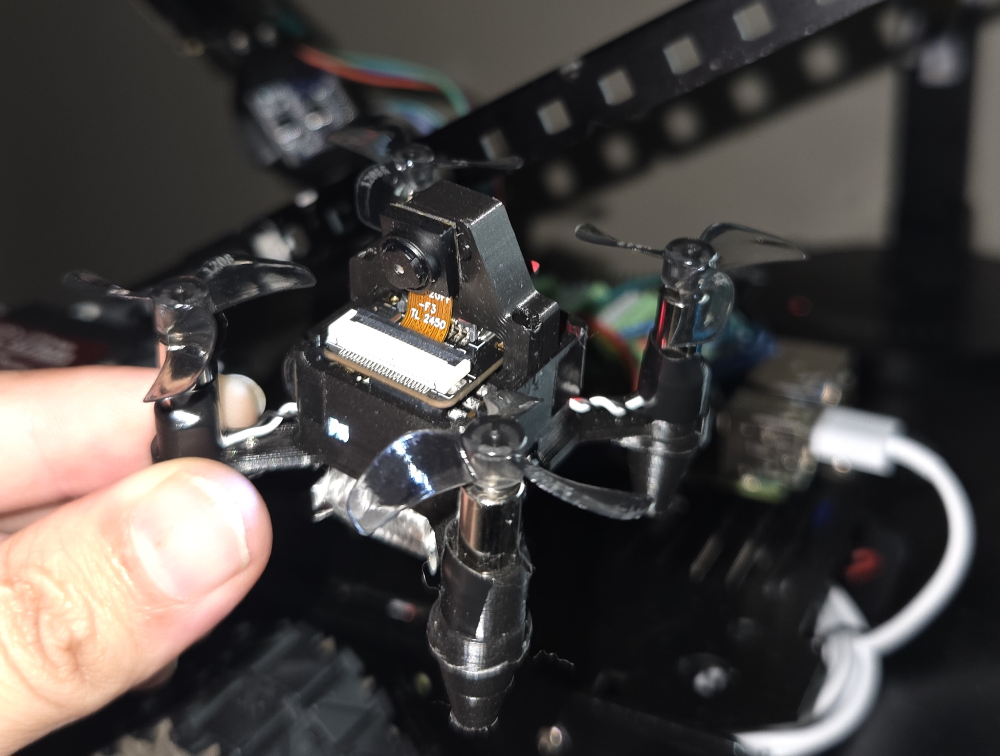
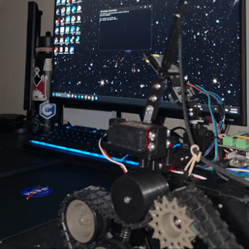

# Persistance & Inventiveness – F´-Based Differential Drive Platform & Quadcopter

  
  

📺 <strong>Demo Playlist:</strong>  
<a href="https://youtube.com/playlist?list=PLc2_zoZcQme6YFMZ-624sp3PF5laEbIG0&si=dT59qtRuxb4fQL4O" target="_blank">Watch on YouTube</a>

---

**Persistance** is a modular ground robot powered by <a href="https://github.com/nasa/fprime" target="_blank">NASA’s F´ (F Prime)</a> flight software framework. Designed for reliable motion control, obstacle sensing, and autonomous decision-making, it uses a differential drive system with real-time feedback from a gyro, encoder, ultrasonic sensor, and a vision sensor mounted on a servo-actuated arm. The software follows the F´ Application–Manager–Driver design pattern, with modular components handling sensor data, control logic, and communication.

**Inventiveness** is an onboard aerial platform designed to launch from the Tank chassis. It features an ESP32 XIAO flight controller and a custom PCB integrating an MPU6050 IMU, VL53L0X time-of-flight sensor, and discrete motor drivers. The drone is intended for future autonomous operations such as aerial photography or scout maneuvers.

  

---

## System Overview

The robot’s software is architected using the <a href="https://fprime.jpl.nasa.gov/latest/docs/user-manual/design-patterns/app-man-drv/" target="_blank"><strong>Application-Manager-Driver</strong></a> pattern, with custom F´ components for motion control, high-level logic, and environment sensing.

### Components

| Component     | Role                                                                                     |
|---------------|------------------------------------------------------------------------------------------|
| `ACE`*        | Central mission controller that coordinates movement modes *(in progress)*               |
| `motion`      | Motion controller: reads sensors, runs PID, and sends motor commands                     |
| `proximityGuard`* | Obstacle detection using an ultrasonic sensor *(in progress)*                        |
| `motCmnd`     | Low-level component that sends `U16`-encoded I²C commands to Romeo                       |
| `flight`*     | Sends flight commands to the onboard drone once the deployment has occured  *(in progress)* |
| `recover`*     | Uses the I2C vision sensor to detect and recover drone autonomously after flight  *(in progress)* |

\* Components marked with an asterisk are currently in progress.

## Hardware Integration

- **ESP32-WROOM** – The main motor controller, receiving I²C commands from the Raspberry Pi  
- **MPU-6050** – Gyroscope providing angular velocity data for heading control via PID  
- **Rotary Encoder** – Tracks wheel rotation for encoder-based distance estimation  
- **Ultrasonic Sensor** – Provides proximity data for obstacle detection and avoidance  
- **HuskyLens Vision Sensor** – Mounted on a servo-actuated arm for vision-based target detection and tracking  
- **PCA9685** – 16 Channel I²C Servo Driver 
- **Raspberry Pi 4 (Ubuntu 22.04)** – Runs the F´ flight software stack and manages high-level system control  
- **Deployable Drone** – Compact drone platform with an ESP32 XIAO flight controller and onboard custom PCB  
- **Custom PCB** – Two-sided board integrating an MPU6050 IMU, VL53L0X time-of-flight sensor, and four motor drivers using SMD MOSFETs and passives for onboard actuation  
- **Zybo Z7-10 FPGA (Temporary)** – Previous test setup for hardware-based I²C slave implementation  
  → [View FPGA I²C project on GitHub](https://github.com/Robles-C/FPrime-Robot/tree/main/verilog)

---

## Key Features

- Modular F´ component architecture
- I²C command packing: 1 byte direction control + 1 byte speed control
- PID-controlled turning using gyro
- PID-controlled movements using encoder
- Obstacle detection and LED response
- Rate-group-based scheduling for precise timing
