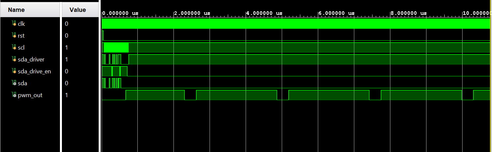
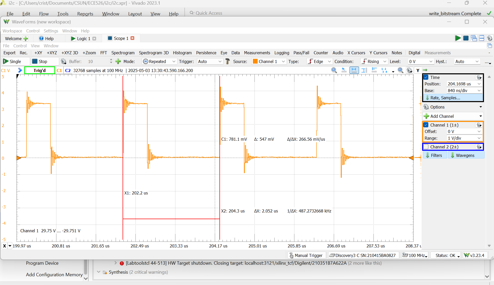
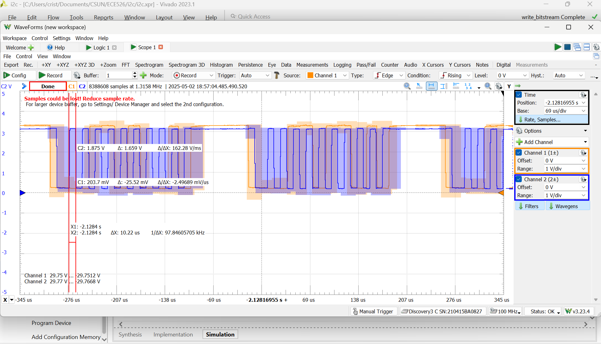
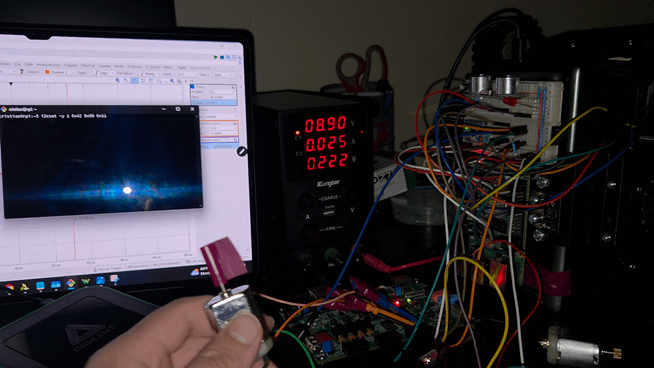

# 🛠️ I²C-Based Motor Controller (Final Project – ECE 526L)

This project implements a custom motor control system using the I²C protocol, developed entirely in Verilog on the Zybo Z7-10 FPGA. It was created as the final project for ECE 526L: Digital Design With Verilog.

## 🔧 Overview

In the original robot system, a Raspberry Pi 4 running Ubuntu 22.04 communicated with a DFRobot Romeo motor controller to control motor speed and direction. This project replaces the Romeo board with a fully hardware-based solution on the FPGA.

### ✴️ System Architecture

- **Raspberry Pi 4 (Master)**
  - Sends 2 bytes via I2C: one for direction, one for speed

- **Zybo Z7-10 FPGA (Slave)**
  - Receives and decodes bytes using an 8 state finite state machine
  - Converts decoded speed byte into PWM signal
  - No embedded software involved

## 📁 Project Structure

| File         | Description                                       |
|--------------|---------------------------------------------------|
| `i2cSlave.v` | FSM-based I2C slave receiver                     |
| `pwmGen.v`   | Parameterized PWM generator                       |
| `top.v`      | Top level module integrating I2C and PWM          |
| `i2c_TB.v`   | Testbench for simulating I2C behavior             |
| `zybo.xdc` | Pin constraints file for Zybo Z7-10         |

## Results

### Simulation
- Verified correct decoding of I2C transactions
- PWM output varied as expected based on input values

  

### Hardware Testing
- **Tools Used:** Digilent Analog Discovery
- Confirmed valid I2C communication on SCL/SDA lines
- Verified PWM waveforms and motor movement on real hardware

  
  

## Robot Demo

The robot successfully moved in response to Pi-sent commands. This demonstrates hardware decoding and control without any software intervention on the FPGA.

  

